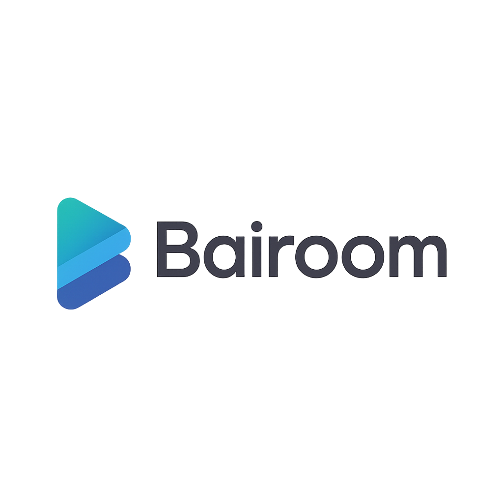

# 🏠 Bairoom - Sistema de Reservas



## 📝 Descripción del proyecto
Bairoom es una plataforma de reservas para habitaciones en viviendas compartidas. Permite a inquilinos solicitar reservas, a propietarios gestionar sus viviendas y a administradores controlar usuarios, recursos y reservas.

## ✨ Características
- Registro, login y gestión de perfiles.
- Roles: Administrador, Propietario e Inquilino.
- Gestión de propiedades y habitaciones con imágenes.
- Reservas con validación de disponibilidad.
- Panel de administración y paneles de usuario.
- Integración con Stripe (modo test).
- Exportación de reservas en PDF.

## 🛠️ Tecnologías utilizadas
- PHP 8
- MySQL / MariaDB
- Bootstrap 5
- Stripe PHP SDK

## 🌍 Enlace al hosting
- https://bairoom.42web.io/Bairoom/

## 🧩 Estructura del proyecto
```text
Bairoom/
|-- .env.example
|-- .gitattributes
|-- .gitignore
|-- admin.php
|-- admin-recursos.php
|-- admin-reservas.php
|-- admin-usuarios.php
|-- aviso-legal.php
|-- bairoom_pi2.sql
|-- coliving.php
|-- contacto.php
|-- cookies.php
|-- css
|   `-- styles.css
|-- docs
|   |-- admin-reservas.php
|   |-- lib
|   |   `-- simple-pdf.php
|   `-- reserva.php
|-- forgot-password.php
|-- habitacion-detalle.php
|-- img
|   |-- ceu.png
|   |-- coliving.png
|   |-- contacto.png
|   |-- corteingles.png
|   |-- fundador.jpeg
|   |-- hab1.png
|   |-- hab2.png
|   |-- hab3.png
|   |-- habsanjuanmar.png
|   |-- index.webp
|   |-- logo.webp
|   |-- logo_blanco.webp
|   |-- propietarios.webp
|   |-- sobrenosotros.webp
|   |-- tempe.webp
|   `-- umh.webp
|-- includes
|   |-- auth.php
|   |-- config.php
|   |-- db.php
|   |-- footer.php
|   |-- header-hero.php
|   `-- header-simple.php
|-- index.php
|-- inquilino-panel.php
|-- js
|   `-- main.js
|-- listado.php
|-- login.php
|-- logout.php
|-- pago-stripe.php
|-- privacidad.php
|-- propietario
|   |-- habitaciones.php
|   |-- propiedades.php
|   |-- propiedad-panel.php
|   `-- propietario-panel.php
|-- propietarios.php
|-- registro.php
|-- reset-password.php
|-- scripts
|   |-- add_panel_badge.php
|   |-- convert_propiedad_panel_utf8.php
|   |-- fix_propiedad_panel_encoding.php
|   |-- fix_propiedad_panel_text.php
|   `-- hash_passwords.php
|-- sobrenosotros.php
|-- stripe
|   |-- cancel.php
|   |-- checkout.php
|   |-- composer.json
|   |-- composer.lock
|   `-- success.php
|-- terminos.php
`-- video
    `-- producto.mp4
```

## 🚀 Instalación
1) Clona el repositorio.
2) Crea tu archivo `.env` con las credenciales de la base de datos.
3) Importa el SQL (ver apartado siguiente).
4) Abre en el navegador:
   - `http://localhost/Bairoom/index.php`

## 🗄️ Base de datos
Tablas principales:
- `usuario`
- `rol`
- `propiedad`
- `habitacion`
- `reserva`
- `pago`

### 📄 Script SQL
El script incluido es `bairoom_pi2.sql`.

### 📥 Importación del SQL
1) Abre phpMyAdmin.
2) Selecciona tu base de datos.
3) Pestaña Importar.
4) Sube `bairoom_pi2.sql`.
5) Confirma la importación.

## ▶️ Uso
- Acceso público a la web y listados de habitaciones.
- Inquilino: reservas, pagos y perfil.
- Propietario: gestión de viviendas y reservas.
- Administrador: usuarios, recursos y reservas.

## ✅ Funcionalidades completadas
- Gestión de usuarios y roles.
- CRUD de recursos (propiedades y habitaciones).
- Reservas con validación de disponibilidad.
- Pagos con Stripe (modo test).
- Exportación de reservas a PDF.

## 🔒 Seguridad
Medidas implementadas:
- Consultas preparadas (PDO).
- Saneamiento con `htmlspecialchars`.
- Passwords con `password_hash` y `password_verify`.
- Control de acceso por roles.

Recomendaciones si fuese un caso real:
- HTTPS y HSTS.
- CSRF tokens en formularios sensibles.
- Rate limiting y protección anti fuerza bruta.
- Logs y auditoría de acciones admin.
- Backups automáticos de BD.

## 📌 Estado del proyecto
Completado y estable para entrega académica.

## 📄 Licencia
MIT

## 👤 Autor
- Jesús Bailén

## 📬 Contacto
- GitHub: https://github.com/jesusbailen

---
Gracias por revisar el proyecto.
